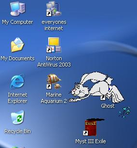



## Animated Desktop Character\.\.\.Part \#1

### Description

This is part#1, using a single .gif file. A crazy rabbit. Drag him around the desktop (provided that you can catch him). Cheers to you. ;)
 
### More Info
 

             |
---                |---
**Submitted On**   |2004-07-02 16:14:34
**By**             |[Chris Seelbach](https://github.com/Planet-Source-Code/PSCIndex/blob/master/ByAuthor/chris-seelbach.md)
**Level**          |Advanced
**User Rating**    |4.7 (14 globes from 3 users)
**Compatibility**  |VB 6\.0
**Category**       |[Graphics](https://github.com/Planet-Source-Code/PSCIndex/blob/master/ByCategory/graphics__1-46.md)
**World**          |[Visual Basic](https://github.com/Planet-Source-Code/PSCIndex/blob/master/ByWorld/visual-basic.md)
**Archive File**   |[Animated\_D176519722004\.zip](https://github.com/Planet-Source-Code/chris-seelbach-animated-desktop-character-part-1__1-54722/archive/master.zip)

